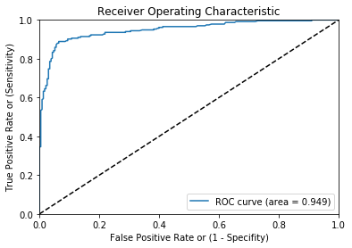

```python
import pandas as pd
import numpy as np
from sklearn.preprocessing import LabelEncoder
import random
from sklearn.ensemble import RandomForestClassifier
from sklearn.ensemble import GradientBoostingClassifier
from sklearn.metrics import roc_curve, auc
import matplotlib.pyplot as plt
import sys
```


```python
# Importing the csv file in pandas and storing it in a dataframe.

file_one = "SFA Craft Demo and Case Study - Huffman.csv"
SFA_df = pd.read_csv(file_one)
SFA_df = SFA_df.drop('opendate', axis = 1)
SFA_df.head()
```


<div>
<style>
    .dataframe thead tr:only-child th {
        text-align: right;
    }

    .dataframe thead th {
        text-align: left;
    }

    .dataframe tbody tr th {
        vertical-align: top;
    }
</style>
<table border="1" class="dataframe">
  <thead>
    <tr style="text-align: right;">
      <th></th>
      <th>ID</th>
      <th>BAD</th>
      <th>AreaCode</th>
      <th>EAScore</th>
      <th>IdentityRank</th>
      <th>DeviceBrowserType</th>
      <th>IpAddressLocCity</th>
      <th>IpAddressLocCountry</th>
      <th>IsValid</th>
      <th>IsConnected</th>
      <th>Personal</th>
      <th>Reputation Level</th>
      <th>ReceivingMail</th>
      <th>Type</th>
      <th>Volume Score</th>
      <th>Result Number</th>
      <th>EmailDays</th>
    </tr>
  </thead>
  <tbody>
    <tr>
      <th>0</th>
      <td>134457</td>
      <td>1</td>
      <td>973</td>
      <td>NaN</td>
      <td>425.0</td>
      <td>TRIDENT</td>
      <td>NaN</td>
      <td>UNITED STATES</td>
      <td>True</td>
      <td>True</td>
      <td>True</td>
      <td>1</td>
      <td>True</td>
      <td>L</td>
      <td>1</td>
      <td>2</td>
      <td>95</td>
    </tr>
    <tr>
      <th>1</th>
      <td>6360592</td>
      <td>0</td>
      <td>310</td>
      <td>930.0</td>
      <td>652.0</td>
      <td>TRIDENT</td>
      <td>AUSTIN</td>
      <td>UNITED STATES</td>
      <td>True</td>
      <td>True</td>
      <td>True</td>
      <td>1</td>
      <td>True</td>
      <td>F</td>
      <td>1</td>
      <td>1</td>
      <td>116</td>
    </tr>
    <tr>
      <th>2</th>
      <td>462987</td>
      <td>0</td>
      <td>502</td>
      <td>704.0</td>
      <td>683.0</td>
      <td>CHROME</td>
      <td>LOUISVILLE</td>
      <td>UNITED STATES</td>
      <td>True</td>
      <td>True</td>
      <td>True</td>
      <td>1</td>
      <td>NaN</td>
      <td>M</td>
      <td>1</td>
      <td>1</td>
      <td>116</td>
    </tr>
    <tr>
      <th>3</th>
      <td>309372</td>
      <td>0</td>
      <td>518</td>
      <td>113.0</td>
      <td>477.0</td>
      <td>FIREFOX</td>
      <td>SCHENECTADY</td>
      <td>UNITED STATES</td>
      <td>True</td>
      <td>True</td>
      <td>True</td>
      <td>1</td>
      <td>NaN</td>
      <td>L</td>
      <td>1</td>
      <td>1</td>
      <td>1513</td>
    </tr>
    <tr>
      <th>4</th>
      <td>397009</td>
      <td>1</td>
      <td>713</td>
      <td>NaN</td>
      <td>587.0</td>
      <td>FIREFOX</td>
      <td>LOS ANGELES</td>
      <td>UNITED STATES</td>
      <td>True</td>
      <td>NaN</td>
      <td>True</td>
      <td>1</td>
      <td>NaN</td>
      <td>N</td>
      <td>1</td>
      <td>1</td>
      <td>0</td>
    </tr>
  </tbody>
</table>
</div>


```python
# # Storing the rest of the data as the test set
# df_train = SFA_df.loc[SFA_df.index.isin(df_0_7.index)]
# df_test = SFA_df.loc[~SFA_df.index.isin(df_0_7.index)]
# df_test.head()
```


```python
# df_train.columns # This will show all the column names
# df_train.head(10) # Show first 10 records of dataframe
# #df_train.describe() #You can look at summary of numerical fields by using describe() function
```


```python
ID_col = ['ID']
target_col = ["BAD"]
cat_cols = ['DeviceBrowserType','IpAddressLocCity','IpAddressLocCountry','IsValid','IsConnected','Personal','ReceivingMail','Type']
num_cols= list(set(list(SFA_df.columns))-set(cat_cols)-set(ID_col)-set(target_col))
 
```


```python
# ID_col = ['ID']
# target_col = ["BAD"]
# cat_cols = ['DeviceBrowserType','IpAddressLocCity','IpAddressLocCountry','IsValid','IsConnected','Personal','ReceivingMail','Type']
# num_cols= list(set(list(df_test.columns))-set(cat_cols)-set(ID_col)-set(target_col))
```


```python
#df_train.isnull().any()
```


```python
num_cat_cols = num_cols+cat_cols # Combined numerical and Categorical variables

#Create a new variable for each variable having missing value with VariableName_NA 
# and flag missing value with 1 and other with 0

for var in num_cat_cols:
    if SFA_df[var].isnull().any()==True:
        SFA_df[var+'_NA']=SFA_df[var].isnull()*1
```


```python
SFA_df
```


<div>
<style>
    .dataframe thead tr:only-child th {
        text-align: right;
    }

    .dataframe thead th {
        text-align: left;
    }

    .dataframe tbody tr th {
        vertical-align: top;
    }
</style>
<table border="1" class="dataframe">
  <thead>
    <tr style="text-align: right;">
      <th></th>
      <th>ID</th>
      <th>BAD</th>
      <th>AreaCode</th>
      <th>EAScore</th>
      <th>IdentityRank</th>
      <th>DeviceBrowserType</th>
      <th>IpAddressLocCity</th>
      <th>IpAddressLocCountry</th>
      <th>IsValid</th>
      <th>IsConnected</th>
      <th>...</th>
      <th>Volume Score</th>
      <th>Result Number</th>
      <th>EmailDays</th>
      <th>EAScore_NA</th>
      <th>IdentityRank_NA</th>
      <th>DeviceBrowserType_NA</th>
      <th>IpAddressLocCity_NA</th>
      <th>IpAddressLocCountry_NA</th>
      <th>IsConnected_NA</th>
      <th>ReceivingMail_NA</th>
    </tr>
  </thead>
  <tbody>
    <tr>
      <th>0</th>
      <td>134457</td>
      <td>1</td>
      <td>973</td>
      <td>NaN</td>
      <td>425.0</td>
      <td>TRIDENT</td>
      <td>NaN</td>
      <td>UNITED STATES</td>
      <td>True</td>
      <td>True</td>
      <td>...</td>
      <td>1</td>
      <td>2</td>
      <td>95</td>
      <td>1</td>
      <td>0</td>
      <td>0</td>
      <td>1</td>
      <td>0</td>
      <td>0</td>
      <td>0</td>
    </tr>
    <tr>
      <th>1</th>
      <td>6360592</td>
      <td>0</td>
      <td>310</td>
      <td>930.0</td>
      <td>652.0</td>
      <td>TRIDENT</td>
      <td>AUSTIN</td>
      <td>UNITED STATES</td>
      <td>True</td>
      <td>True</td>
      <td>...</td>
      <td>1</td>
      <td>1</td>
      <td>116</td>
      <td>0</td>
      <td>0</td>
      <td>0</td>
      <td>0</td>
      <td>0</td>
      <td>0</td>
      <td>0</td>
    </tr>
    <tr>
      <th>2</th>
      <td>462987</td>
      <td>0</td>
      <td>502</td>
      <td>704.0</td>
      <td>683.0</td>
      <td>CHROME</td>
      <td>LOUISVILLE</td>
      <td>UNITED STATES</td>
      <td>True</td>
      <td>True</td>
      <td>...</td>
      <td>1</td>
      <td>1</td>
      <td>116</td>
      <td>0</td>
      <td>0</td>
      <td>0</td>
      <td>0</td>
      <td>0</td>
      <td>0</td>
      <td>1</td>
    </tr>
    <tr>
      <th>3</th>
      <td>309372</td>
      <td>0</td>
      <td>518</td>
      <td>113.0</td>
      <td>477.0</td>
      <td>FIREFOX</td>
      <td>SCHENECTADY</td>
      <td>UNITED STATES</td>
      <td>True</td>
      <td>True</td>
      <td>...</td>
      <td>1</td>
      <td>1</td>
      <td>1513</td>
      <td>0</td>
      <td>0</td>
      <td>0</td>
      <td>0</td>
      <td>0</td>
      <td>0</td>
      <td>1</td>
    </tr>
    <tr>
      <th>4</th>
      <td>397009</td>
      <td>1</td>
      <td>713</td>
      <td>NaN</td>
      <td>587.0</td>
      <td>FIREFOX</td>
      <td>LOS ANGELES</td>
      <td>UNITED STATES</td>
      <td>True</td>
      <td>NaN</td>
      <td>...</td>
      <td>1</td>
      <td>1</td>
      <td>0</td>
      <td>1</td>
      <td>0</td>
      <td>0</td>
      <td>0</td>
      <td>0</td>
      <td>1</td>
      <td>1</td>
    </tr>
    <tr>
      <th>5</th>
      <td>7725516</td>
      <td>1</td>
      <td>859</td>
      <td>NaN</td>
      <td>394.0</td>
      <td>CHROME</td>
      <td>REYNOLDSBURG</td>
      <td>UNITED STATES</td>
      <td>True</td>
      <td>NaN</td>
      <td>...</td>
      <td>1</td>
      <td>1</td>
      <td>104</td>
      <td>1</td>
      <td>0</td>
      <td>0</td>
      <td>0</td>
      <td>0</td>
      <td>1</td>
      <td>0</td>
    </tr>
    <tr>
      <th>6</th>
      <td>9696430</td>
      <td>0</td>
      <td>419</td>
      <td>99.0</td>
      <td>348.0</td>
      <td>CHROME</td>
      <td>NEW YORK</td>
      <td>UNITED STATES</td>
      <td>True</td>
      <td>True</td>
      <td>...</td>
      <td>1</td>
      <td>1</td>
      <td>1596</td>
      <td>0</td>
      <td>0</td>
      <td>0</td>
      <td>0</td>
      <td>0</td>
      <td>0</td>
      <td>1</td>
    </tr>
    <tr>
      <th>7</th>
      <td>1558104</td>
      <td>1</td>
      <td>631</td>
      <td>NaN</td>
      <td>512.0</td>
      <td>FIREFOX</td>
      <td>MINNEAPOLIS</td>
      <td>UNITED STATES</td>
      <td>True</td>
      <td>True</td>
      <td>...</td>
      <td>1</td>
      <td>1</td>
      <td>0</td>
      <td>1</td>
      <td>0</td>
      <td>0</td>
      <td>0</td>
      <td>0</td>
      <td>0</td>
      <td>1</td>
    </tr>
    <tr>
      <th>8</th>
      <td>6210621</td>
      <td>0</td>
      <td>970</td>
      <td>87.0</td>
      <td>517.0</td>
      <td>NaN</td>
      <td>NaN</td>
      <td>NaN</td>
      <td>True</td>
      <td>True</td>
      <td>...</td>
      <td>1</td>
      <td>1</td>
      <td>2531</td>
      <td>0</td>
      <td>0</td>
      <td>1</td>
      <td>1</td>
      <td>1</td>
      <td>0</td>
      <td>0</td>
    </tr>
    <tr>
      <th>9</th>
      <td>3945665</td>
      <td>0</td>
      <td>319</td>
      <td>300.0</td>
      <td>526.0</td>
      <td>FIREFOX</td>
      <td>KALONA</td>
      <td>UNITED STATES</td>
      <td>True</td>
      <td>True</td>
      <td>...</td>
      <td>2</td>
      <td>3</td>
      <td>114</td>
      <td>0</td>
      <td>0</td>
      <td>0</td>
      <td>0</td>
      <td>0</td>
      <td>0</td>
      <td>0</td>
    </tr>
    <tr>
      <th>10</th>
      <td>4138224</td>
      <td>1</td>
      <td>402</td>
      <td>NaN</td>
      <td>NaN</td>
      <td>NaN</td>
      <td>NaN</td>
      <td>NaN</td>
      <td>True</td>
      <td>True</td>
      <td>...</td>
      <td>1</td>
      <td>8</td>
      <td>0</td>
      <td>1</td>
      <td>1</td>
      <td>1</td>
      <td>1</td>
      <td>1</td>
      <td>0</td>
      <td>0</td>
    </tr>
    <tr>
      <th>11</th>
      <td>2729407</td>
      <td>0</td>
      <td>805</td>
      <td>500.0</td>
      <td>644.0</td>
      <td>NaN</td>
      <td>NaN</td>
      <td>NaN</td>
      <td>True</td>
      <td>True</td>
      <td>...</td>
      <td>1</td>
      <td>1</td>
      <td>1000</td>
      <td>0</td>
      <td>0</td>
      <td>1</td>
      <td>1</td>
      <td>1</td>
      <td>0</td>
      <td>0</td>
    </tr>
    <tr>
      <th>12</th>
      <td>7154858</td>
      <td>1</td>
      <td>858</td>
      <td>NaN</td>
      <td>605.0</td>
      <td>CHROME</td>
      <td>SAN DIEGO</td>
      <td>UNITED STATES</td>
      <td>True</td>
      <td>NaN</td>
      <td>...</td>
      <td>1</td>
      <td>1</td>
      <td>0</td>
      <td>1</td>
      <td>0</td>
      <td>0</td>
      <td>0</td>
      <td>0</td>
      <td>1</td>
      <td>0</td>
    </tr>
    <tr>
      <th>13</th>
      <td>67922</td>
      <td>1</td>
      <td>406</td>
      <td>500.0</td>
      <td>595.0</td>
      <td>CHROME</td>
      <td>ROANOKE</td>
      <td>UNITED STATES</td>
      <td>True</td>
      <td>NaN</td>
      <td>...</td>
      <td>1</td>
      <td>11</td>
      <td>82</td>
      <td>0</td>
      <td>0</td>
      <td>0</td>
      <td>0</td>
      <td>0</td>
      <td>1</td>
      <td>0</td>
    </tr>
    <tr>
      <th>14</th>
      <td>8447883</td>
      <td>0</td>
      <td>818</td>
      <td>97.0</td>
      <td>835.0</td>
      <td>NaN</td>
      <td>NaN</td>
      <td>NaN</td>
      <td>True</td>
      <td>True</td>
      <td>...</td>
      <td>2</td>
      <td>7</td>
      <td>1561</td>
      <td>0</td>
      <td>0</td>
      <td>1</td>
      <td>1</td>
      <td>1</td>
      <td>0</td>
      <td>0</td>
    </tr>
    <tr>
      <th>15</th>
      <td>6114886</td>
      <td>1</td>
      <td>440</td>
      <td>965.0</td>
      <td>491.0</td>
      <td>NaN</td>
      <td>NaN</td>
      <td>NaN</td>
      <td>True</td>
      <td>True</td>
      <td>...</td>
      <td>2</td>
      <td>4</td>
      <td>98</td>
      <td>0</td>
      <td>0</td>
      <td>1</td>
      <td>1</td>
      <td>1</td>
      <td>0</td>
      <td>0</td>
    </tr>
    <tr>
      <th>16</th>
      <td>5867757</td>
      <td>0</td>
      <td>615</td>
      <td>161.0</td>
      <td>463.0</td>
      <td>TRIDENT</td>
      <td>DICKSON</td>
      <td>UNITED STATES</td>
      <td>True</td>
      <td>True</td>
      <td>...</td>
      <td>1</td>
      <td>1</td>
      <td>1342</td>
      <td>0</td>
      <td>0</td>
      <td>0</td>
      <td>0</td>
      <td>0</td>
      <td>0</td>
      <td>0</td>
    </tr>
    <tr>
      <th>17</th>
      <td>6135179</td>
      <td>1</td>
      <td>419</td>
      <td>930.0</td>
      <td>417.0</td>
      <td>CHROME</td>
      <td>YOUNGSTOWN</td>
      <td>UNITED STATES</td>
      <td>True</td>
      <td>True</td>
      <td>...</td>
      <td>2</td>
      <td>7</td>
      <td>116</td>
      <td>0</td>
      <td>0</td>
      <td>0</td>
      <td>0</td>
      <td>0</td>
      <td>0</td>
      <td>0</td>
    </tr>
    <tr>
      <th>18</th>
      <td>4308867</td>
      <td>0</td>
      <td>202</td>
      <td>83.0</td>
      <td>424.0</td>
      <td>CHROME</td>
      <td>CHANTILLY</td>
      <td>UNITED STATES</td>
      <td>True</td>
      <td>True</td>
      <td>...</td>
      <td>1</td>
      <td>2</td>
      <td>124</td>
      <td>0</td>
      <td>0</td>
      <td>0</td>
      <td>0</td>
      <td>0</td>
      <td>0</td>
      <td>0</td>
    </tr>
    <tr>
      <th>19</th>
      <td>4926970</td>
      <td>0</td>
      <td>602</td>
      <td>132.0</td>
      <td>395.0</td>
      <td>INTERNET EXPLORER</td>
      <td>MESA</td>
      <td>UNITED STATES</td>
      <td>True</td>
      <td>True</td>
      <td>...</td>
      <td>1</td>
      <td>1</td>
      <td>1096</td>
      <td>0</td>
      <td>0</td>
      <td>0</td>
      <td>0</td>
      <td>0</td>
      <td>0</td>
      <td>1</td>
    </tr>
    <tr>
      <th>20</th>
      <td>2596928</td>
      <td>1</td>
      <td>920</td>
      <td>NaN</td>
      <td>455.0</td>
      <td>TRIDENT</td>
      <td>MADISON</td>
      <td>UNITED STATES</td>
      <td>True</td>
      <td>True</td>
      <td>...</td>
      <td>1</td>
      <td>3</td>
      <td>144</td>
      <td>1</td>
      <td>0</td>
      <td>0</td>
      <td>0</td>
      <td>0</td>
      <td>0</td>
      <td>0</td>
    </tr>
    <tr>
      <th>21</th>
      <td>3155691</td>
      <td>0</td>
      <td>901</td>
      <td>83.0</td>
      <td>371.0</td>
      <td>SAFARI</td>
      <td>NASHVILLE</td>
      <td>UNITED STATES</td>
      <td>True</td>
      <td>True</td>
      <td>...</td>
      <td>1</td>
      <td>1</td>
      <td>185</td>
      <td>0</td>
      <td>0</td>
      <td>0</td>
      <td>0</td>
      <td>0</td>
      <td>0</td>
      <td>1</td>
    </tr>
    <tr>
      <th>22</th>
      <td>8385877</td>
      <td>1</td>
      <td>603</td>
      <td>NaN</td>
      <td>416.0</td>
      <td>FIREFOX</td>
      <td>CAPE CORAL</td>
      <td>UNITED STATES</td>
      <td>True</td>
      <td>True</td>
      <td>...</td>
      <td>2</td>
      <td>2</td>
      <td>0</td>
      <td>1</td>
      <td>0</td>
      <td>0</td>
      <td>0</td>
      <td>0</td>
      <td>0</td>
      <td>0</td>
    </tr>
    <tr>
      <th>23</th>
      <td>7891683</td>
      <td>1</td>
      <td>702</td>
      <td>500.0</td>
      <td>430.0</td>
      <td>NETSCAPE</td>
      <td>NORTH LAS VEGAS</td>
      <td>UNITED STATES</td>
      <td>True</td>
      <td>True</td>
      <td>...</td>
      <td>1</td>
      <td>2</td>
      <td>116</td>
      <td>0</td>
      <td>0</td>
      <td>0</td>
      <td>0</td>
      <td>0</td>
      <td>0</td>
      <td>0</td>
    </tr>
    <tr>
      <th>24</th>
      <td>1288098</td>
      <td>1</td>
      <td>916</td>
      <td>964.0</td>
      <td>471.0</td>
      <td>NaN</td>
      <td>NaN</td>
      <td>NaN</td>
      <td>True</td>
      <td>True</td>
      <td>...</td>
      <td>1</td>
      <td>1</td>
      <td>69</td>
      <td>0</td>
      <td>0</td>
      <td>1</td>
      <td>1</td>
      <td>1</td>
      <td>0</td>
      <td>1</td>
    </tr>
    <tr>
      <th>25</th>
      <td>6406300</td>
      <td>1</td>
      <td>210</td>
      <td>165.0</td>
      <td>500.0</td>
      <td>SAFARI</td>
      <td>HUNTINGTON BEACH</td>
      <td>UNITED STATES</td>
      <td>True</td>
      <td>True</td>
      <td>...</td>
      <td>1</td>
      <td>1</td>
      <td>1264</td>
      <td>0</td>
      <td>0</td>
      <td>0</td>
      <td>0</td>
      <td>0</td>
      <td>0</td>
      <td>1</td>
    </tr>
    <tr>
      <th>26</th>
      <td>1956434</td>
      <td>0</td>
      <td>831</td>
      <td>97.0</td>
      <td>537.0</td>
      <td>NaN</td>
      <td>NaN</td>
      <td>NaN</td>
      <td>True</td>
      <td>True</td>
      <td>...</td>
      <td>2</td>
      <td>1</td>
      <td>1774</td>
      <td>0</td>
      <td>0</td>
      <td>1</td>
      <td>1</td>
      <td>1</td>
      <td>0</td>
      <td>0</td>
    </tr>
    <tr>
      <th>27</th>
      <td>7468087</td>
      <td>1</td>
      <td>715</td>
      <td>233.0</td>
      <td>486.0</td>
      <td>NaN</td>
      <td>NaN</td>
      <td>NaN</td>
      <td>True</td>
      <td>True</td>
      <td>...</td>
      <td>1</td>
      <td>1</td>
      <td>0</td>
      <td>0</td>
      <td>0</td>
      <td>1</td>
      <td>1</td>
      <td>1</td>
      <td>0</td>
      <td>0</td>
    </tr>
    <tr>
      <th>28</th>
      <td>4194683</td>
      <td>1</td>
      <td>301</td>
      <td>965.0</td>
      <td>493.0</td>
      <td>FIREFOX</td>
      <td>BEDFORD</td>
      <td>UNITED STATES</td>
      <td>True</td>
      <td>True</td>
      <td>...</td>
      <td>1</td>
      <td>9</td>
      <td>124</td>
      <td>0</td>
      <td>0</td>
      <td>0</td>
      <td>0</td>
      <td>0</td>
      <td>0</td>
      <td>0</td>
    </tr>
    <tr>
      <th>29</th>
      <td>48504</td>
      <td>0</td>
      <td>219</td>
      <td>73.0</td>
      <td>391.0</td>
      <td>NaN</td>
      <td>NaN</td>
      <td>NaN</td>
      <td>True</td>
      <td>True</td>
      <td>...</td>
      <td>1</td>
      <td>4</td>
      <td>2576</td>
      <td>0</td>
      <td>0</td>
      <td>1</td>
      <td>1</td>
      <td>1</td>
      <td>0</td>
      <td>0</td>
    </tr>
    <tr>
      <th>...</th>
      <td>...</td>
      <td>...</td>
      <td>...</td>
      <td>...</td>
      <td>...</td>
      <td>...</td>
      <td>...</td>
      <td>...</td>
      <td>...</td>
      <td>...</td>
      <td>...</td>
      <td>...</td>
      <td>...</td>
      <td>...</td>
      <td>...</td>
      <td>...</td>
      <td>...</td>
      <td>...</td>
      <td>...</td>
      <td>...</td>
      <td>...</td>
    </tr>
    <tr>
      <th>2745</th>
      <td>2505705</td>
      <td>0</td>
      <td>214</td>
      <td>86.0</td>
      <td>382.0</td>
      <td>FIREFOX</td>
      <td>PLANO</td>
      <td>UNITED STATES</td>
      <td>True</td>
      <td>True</td>
      <td>...</td>
      <td>1</td>
      <td>1</td>
      <td>2575</td>
      <td>0</td>
      <td>0</td>
      <td>0</td>
      <td>0</td>
      <td>0</td>
      <td>0</td>
      <td>0</td>
    </tr>
    <tr>
      <th>2746</th>
      <td>7223926</td>
      <td>0</td>
      <td>406</td>
      <td>85.0</td>
      <td>525.0</td>
      <td>NaN</td>
      <td>NaN</td>
      <td>NaN</td>
      <td>True</td>
      <td>True</td>
      <td>...</td>
      <td>1</td>
      <td>1</td>
      <td>2490</td>
      <td>0</td>
      <td>0</td>
      <td>1</td>
      <td>1</td>
      <td>1</td>
      <td>0</td>
      <td>0</td>
    </tr>
    <tr>
      <th>2747</th>
      <td>5473254</td>
      <td>0</td>
      <td>352</td>
      <td>105.0</td>
      <td>456.0</td>
      <td>INTERNET EXPLORER</td>
      <td>PHOENIX</td>
      <td>UNITED STATES</td>
      <td>True</td>
      <td>True</td>
      <td>...</td>
      <td>2</td>
      <td>4</td>
      <td>926</td>
      <td>0</td>
      <td>0</td>
      <td>0</td>
      <td>0</td>
      <td>0</td>
      <td>0</td>
      <td>0</td>
    </tr>
    <tr>
      <th>2748</th>
      <td>2265035</td>
      <td>1</td>
      <td>202</td>
      <td>NaN</td>
      <td>513.0</td>
      <td>CHROME</td>
      <td>LOS ANGELES</td>
      <td>UNITED STATES</td>
      <td>True</td>
      <td>True</td>
      <td>...</td>
      <td>1</td>
      <td>8</td>
      <td>95</td>
      <td>1</td>
      <td>0</td>
      <td>0</td>
      <td>0</td>
      <td>0</td>
      <td>0</td>
      <td>0</td>
    </tr>
    <tr>
      <th>2749</th>
      <td>216757</td>
      <td>0</td>
      <td>800</td>
      <td>500.0</td>
      <td>497.0</td>
      <td>NaN</td>
      <td>NaN</td>
      <td>NaN</td>
      <td>True</td>
      <td>NaN</td>
      <td>...</td>
      <td>1</td>
      <td>1</td>
      <td>114</td>
      <td>0</td>
      <td>0</td>
      <td>1</td>
      <td>1</td>
      <td>1</td>
      <td>1</td>
      <td>1</td>
    </tr>
    <tr>
      <th>2750</th>
      <td>9362663</td>
      <td>1</td>
      <td>716</td>
      <td>500.0</td>
      <td>560.0</td>
      <td>CHROME</td>
      <td>EUGENE</td>
      <td>UNITED STATES</td>
      <td>True</td>
      <td>NaN</td>
      <td>...</td>
      <td>1</td>
      <td>1</td>
      <td>84</td>
      <td>0</td>
      <td>0</td>
      <td>0</td>
      <td>0</td>
      <td>0</td>
      <td>1</td>
      <td>1</td>
    </tr>
    <tr>
      <th>2751</th>
      <td>4121195</td>
      <td>0</td>
      <td>949</td>
      <td>94.0</td>
      <td>446.0</td>
      <td>INTERNET EXPLORER</td>
      <td>PAHRUMP</td>
      <td>UNITED STATES</td>
      <td>True</td>
      <td>True</td>
      <td>...</td>
      <td>1</td>
      <td>1</td>
      <td>2740</td>
      <td>0</td>
      <td>0</td>
      <td>0</td>
      <td>0</td>
      <td>0</td>
      <td>0</td>
      <td>1</td>
    </tr>
    <tr>
      <th>2752</th>
      <td>2503815</td>
      <td>1</td>
      <td>610</td>
      <td>955.0</td>
      <td>507.0</td>
      <td>NaN</td>
      <td>NaN</td>
      <td>NaN</td>
      <td>True</td>
      <td>NaN</td>
      <td>...</td>
      <td>1</td>
      <td>1</td>
      <td>71</td>
      <td>0</td>
      <td>0</td>
      <td>1</td>
      <td>1</td>
      <td>1</td>
      <td>1</td>
      <td>1</td>
    </tr>
    <tr>
      <th>2753</th>
      <td>7394574</td>
      <td>0</td>
      <td>843</td>
      <td>88.0</td>
      <td>572.0</td>
      <td>INTERNET EXPLORER</td>
      <td>GOOSE CREEK</td>
      <td>UNITED STATES</td>
      <td>True</td>
      <td>True</td>
      <td>...</td>
      <td>1</td>
      <td>1</td>
      <td>2418</td>
      <td>0</td>
      <td>0</td>
      <td>0</td>
      <td>0</td>
      <td>0</td>
      <td>0</td>
      <td>0</td>
    </tr>
    <tr>
      <th>2754</th>
      <td>7673876</td>
      <td>0</td>
      <td>770</td>
      <td>130.0</td>
      <td>523.0</td>
      <td>TRIDENT</td>
      <td>ALPHARETTA</td>
      <td>UNITED STATES</td>
      <td>True</td>
      <td>NaN</td>
      <td>...</td>
      <td>2</td>
      <td>1</td>
      <td>0</td>
      <td>0</td>
      <td>0</td>
      <td>0</td>
      <td>0</td>
      <td>0</td>
      <td>1</td>
      <td>0</td>
    </tr>
    <tr>
      <th>2755</th>
      <td>2606005</td>
      <td>0</td>
      <td>434</td>
      <td>238.0</td>
      <td>495.0</td>
      <td>INTERNET EXPLORER</td>
      <td>CHARLOTTESVILLE</td>
      <td>UNITED STATES</td>
      <td>True</td>
      <td>True</td>
      <td>...</td>
      <td>1</td>
      <td>1</td>
      <td>628</td>
      <td>0</td>
      <td>0</td>
      <td>0</td>
      <td>0</td>
      <td>0</td>
      <td>0</td>
      <td>1</td>
    </tr>
    <tr>
      <th>2756</th>
      <td>9138678</td>
      <td>1</td>
      <td>205</td>
      <td>965.0</td>
      <td>573.0</td>
      <td>FIREFOX</td>
      <td>BIRMINGHAM</td>
      <td>UNITED STATES</td>
      <td>True</td>
      <td>True</td>
      <td>...</td>
      <td>1</td>
      <td>2</td>
      <td>69</td>
      <td>0</td>
      <td>0</td>
      <td>0</td>
      <td>0</td>
      <td>0</td>
      <td>0</td>
      <td>0</td>
    </tr>
    <tr>
      <th>2757</th>
      <td>5327816</td>
      <td>0</td>
      <td>917</td>
      <td>80.0</td>
      <td>467.0</td>
      <td>SAFARI</td>
      <td>SAINT JAMES</td>
      <td>UNITED STATES</td>
      <td>True</td>
      <td>True</td>
      <td>...</td>
      <td>1</td>
      <td>2</td>
      <td>3047</td>
      <td>0</td>
      <td>0</td>
      <td>0</td>
      <td>0</td>
      <td>0</td>
      <td>0</td>
      <td>0</td>
    </tr>
    <tr>
      <th>2758</th>
      <td>412677</td>
      <td>0</td>
      <td>949</td>
      <td>197.0</td>
      <td>448.0</td>
      <td>CHROME</td>
      <td>SAN CLEMENTE</td>
      <td>UNITED STATES</td>
      <td>True</td>
      <td>True</td>
      <td>...</td>
      <td>1</td>
      <td>8</td>
      <td>685</td>
      <td>0</td>
      <td>0</td>
      <td>0</td>
      <td>0</td>
      <td>0</td>
      <td>0</td>
      <td>0</td>
    </tr>
    <tr>
      <th>2759</th>
      <td>67022</td>
      <td>1</td>
      <td>954</td>
      <td>NaN</td>
      <td>631.0</td>
      <td>FIREFOX</td>
      <td>BEVERLY HILLS</td>
      <td>UNITED STATES</td>
      <td>True</td>
      <td>NaN</td>
      <td>...</td>
      <td>1</td>
      <td>13</td>
      <td>0</td>
      <td>1</td>
      <td>0</td>
      <td>0</td>
      <td>0</td>
      <td>0</td>
      <td>1</td>
      <td>0</td>
    </tr>
    <tr>
      <th>2760</th>
      <td>8588623</td>
      <td>0</td>
      <td>860</td>
      <td>500.0</td>
      <td>433.0</td>
      <td>INTERNET EXPLORER</td>
      <td>AVON</td>
      <td>UNITED STATES</td>
      <td>True</td>
      <td>True</td>
      <td>...</td>
      <td>1</td>
      <td>1</td>
      <td>1088</td>
      <td>0</td>
      <td>0</td>
      <td>0</td>
      <td>0</td>
      <td>0</td>
      <td>0</td>
      <td>0</td>
    </tr>
    <tr>
      <th>2761</th>
      <td>6163613</td>
      <td>0</td>
      <td>651</td>
      <td>125.0</td>
      <td>473.0</td>
      <td>NaN</td>
      <td>NaN</td>
      <td>NaN</td>
      <td>True</td>
      <td>True</td>
      <td>...</td>
      <td>1</td>
      <td>12</td>
      <td>1327</td>
      <td>0</td>
      <td>0</td>
      <td>1</td>
      <td>1</td>
      <td>1</td>
      <td>0</td>
      <td>0</td>
    </tr>
    <tr>
      <th>2762</th>
      <td>6160099</td>
      <td>0</td>
      <td>631</td>
      <td>50.0</td>
      <td>514.0</td>
      <td>INTERNET EXPLORER</td>
      <td>HICKSVILLE</td>
      <td>UNITED STATES</td>
      <td>True</td>
      <td>True</td>
      <td>...</td>
      <td>1</td>
      <td>1</td>
      <td>2053</td>
      <td>0</td>
      <td>0</td>
      <td>0</td>
      <td>0</td>
      <td>0</td>
      <td>0</td>
      <td>0</td>
    </tr>
    <tr>
      <th>2763</th>
      <td>173667</td>
      <td>0</td>
      <td>512</td>
      <td>179.0</td>
      <td>494.0</td>
      <td>INTERNET EXPLORER</td>
      <td>KANSAS CITY</td>
      <td>UNITED STATES</td>
      <td>True</td>
      <td>True</td>
      <td>...</td>
      <td>1</td>
      <td>1</td>
      <td>1004</td>
      <td>0</td>
      <td>0</td>
      <td>0</td>
      <td>0</td>
      <td>0</td>
      <td>0</td>
      <td>0</td>
    </tr>
    <tr>
      <th>2764</th>
      <td>596120</td>
      <td>0</td>
      <td>908</td>
      <td>500.0</td>
      <td>534.0</td>
      <td>CHROME</td>
      <td>FLEMINGTON</td>
      <td>UNITED STATES</td>
      <td>True</td>
      <td>True</td>
      <td>...</td>
      <td>1</td>
      <td>1</td>
      <td>102</td>
      <td>0</td>
      <td>0</td>
      <td>0</td>
      <td>0</td>
      <td>0</td>
      <td>0</td>
      <td>1</td>
    </tr>
    <tr>
      <th>2765</th>
      <td>3327163</td>
      <td>1</td>
      <td>952</td>
      <td>963.0</td>
      <td>417.0</td>
      <td>NaN</td>
      <td>NaN</td>
      <td>NaN</td>
      <td>True</td>
      <td>NaN</td>
      <td>...</td>
      <td>1</td>
      <td>2</td>
      <td>94</td>
      <td>0</td>
      <td>0</td>
      <td>1</td>
      <td>1</td>
      <td>1</td>
      <td>1</td>
      <td>0</td>
    </tr>
    <tr>
      <th>2766</th>
      <td>240816</td>
      <td>0</td>
      <td>508</td>
      <td>84.0</td>
      <td>433.0</td>
      <td>FIREFOX</td>
      <td>MILFORD</td>
      <td>UNITED STATES</td>
      <td>True</td>
      <td>True</td>
      <td>...</td>
      <td>1</td>
      <td>2</td>
      <td>2741</td>
      <td>0</td>
      <td>0</td>
      <td>0</td>
      <td>0</td>
      <td>0</td>
      <td>0</td>
      <td>0</td>
    </tr>
    <tr>
      <th>2767</th>
      <td>1253018</td>
      <td>0</td>
      <td>484</td>
      <td>500.0</td>
      <td>552.0</td>
      <td>CHROME</td>
      <td>WAYNE</td>
      <td>UNITED STATES</td>
      <td>True</td>
      <td>True</td>
      <td>...</td>
      <td>2</td>
      <td>8</td>
      <td>102</td>
      <td>0</td>
      <td>0</td>
      <td>0</td>
      <td>0</td>
      <td>0</td>
      <td>0</td>
      <td>0</td>
    </tr>
    <tr>
      <th>2768</th>
      <td>1992484</td>
      <td>1</td>
      <td>925</td>
      <td>960.0</td>
      <td>477.0</td>
      <td>NaN</td>
      <td>NaN</td>
      <td>NaN</td>
      <td>True</td>
      <td>NaN</td>
      <td>...</td>
      <td>1</td>
      <td>7</td>
      <td>83</td>
      <td>0</td>
      <td>0</td>
      <td>1</td>
      <td>1</td>
      <td>1</td>
      <td>1</td>
      <td>0</td>
    </tr>
    <tr>
      <th>2769</th>
      <td>3072368</td>
      <td>0</td>
      <td>435</td>
      <td>137.0</td>
      <td>527.0</td>
      <td>NaN</td>
      <td>WEST JORDAN</td>
      <td>UNITED STATES</td>
      <td>True</td>
      <td>True</td>
      <td>...</td>
      <td>1</td>
      <td>1</td>
      <td>1011</td>
      <td>0</td>
      <td>0</td>
      <td>1</td>
      <td>0</td>
      <td>0</td>
      <td>0</td>
      <td>0</td>
    </tr>
    <tr>
      <th>2770</th>
      <td>5398856</td>
      <td>0</td>
      <td>516</td>
      <td>500.0</td>
      <td>410.0</td>
      <td>FIREFOX</td>
      <td>LYNBROOK</td>
      <td>UNITED STATES</td>
      <td>True</td>
      <td>True</td>
      <td>...</td>
      <td>1</td>
      <td>1</td>
      <td>251</td>
      <td>0</td>
      <td>0</td>
      <td>0</td>
      <td>0</td>
      <td>0</td>
      <td>0</td>
      <td>0</td>
    </tr>
    <tr>
      <th>2771</th>
      <td>4560427</td>
      <td>1</td>
      <td>516</td>
      <td>965.0</td>
      <td>542.0</td>
      <td>NaN</td>
      <td>NaN</td>
      <td>NaN</td>
      <td>True</td>
      <td>True</td>
      <td>...</td>
      <td>1</td>
      <td>1</td>
      <td>88</td>
      <td>0</td>
      <td>0</td>
      <td>1</td>
      <td>1</td>
      <td>1</td>
      <td>0</td>
      <td>0</td>
    </tr>
    <tr>
      <th>2772</th>
      <td>7985843</td>
      <td>0</td>
      <td>949</td>
      <td>110.0</td>
      <td>402.0</td>
      <td>INTERNET EXPLORER</td>
      <td>NEWPORT BEACH</td>
      <td>UNITED STATES</td>
      <td>True</td>
      <td>True</td>
      <td>...</td>
      <td>1</td>
      <td>1</td>
      <td>1537</td>
      <td>0</td>
      <td>0</td>
      <td>0</td>
      <td>0</td>
      <td>0</td>
      <td>0</td>
      <td>1</td>
    </tr>
    <tr>
      <th>2773</th>
      <td>6301883</td>
      <td>1</td>
      <td>517</td>
      <td>NaN</td>
      <td>510.0</td>
      <td>FIREFOX</td>
      <td>CLEARWATER</td>
      <td>UNITED STATES</td>
      <td>True</td>
      <td>True</td>
      <td>...</td>
      <td>1</td>
      <td>6</td>
      <td>0</td>
      <td>1</td>
      <td>0</td>
      <td>0</td>
      <td>0</td>
      <td>0</td>
      <td>0</td>
      <td>0</td>
    </tr>
    <tr>
      <th>2774</th>
      <td>3140120</td>
      <td>1</td>
      <td>310</td>
      <td>500.0</td>
      <td>782.0</td>
      <td>NaN</td>
      <td>NaN</td>
      <td>NaN</td>
      <td>True</td>
      <td>True</td>
      <td>...</td>
      <td>1</td>
      <td>1</td>
      <td>133</td>
      <td>0</td>
      <td>0</td>
      <td>1</td>
      <td>1</td>
      <td>1</td>
      <td>0</td>
      <td>0</td>
    </tr>
  </tbody>
</table>
<p>2775 rows × 24 columns</p>
</div>


```python
SFA_df[num_cols] = SFA_df[num_cols].fillna(SFA_df[num_cols].median(),inplace=True)

SFA_df[cat_cols] = SFA_df[cat_cols].fillna(value = -9999)

SFA_df.head()
```

    /anaconda/lib/python3.6/site-packages/pandas/core/generic.py:3549: SettingWithCopyWarning: 
    A value is trying to be set on a copy of a slice from a DataFrame
    
    See the caveats in the documentation: http://pandas.pydata.org/pandas-docs/stable/indexing.html#indexing-view-versus-copy
      self._update_inplace(new_data)


<div>
<style>
    .dataframe thead tr:only-child th {
        text-align: right;
    }

    .dataframe thead th {
        text-align: left;
    }

    .dataframe tbody tr th {
        vertical-align: top;
    }
</style>
<table border="1" class="dataframe">
  <thead>
    <tr style="text-align: right;">
      <th></th>
      <th>ID</th>
      <th>BAD</th>
      <th>AreaCode</th>
      <th>EAScore</th>
      <th>IdentityRank</th>
      <th>DeviceBrowserType</th>
      <th>IpAddressLocCity</th>
      <th>IpAddressLocCountry</th>
      <th>IsValid</th>
      <th>IsConnected</th>
      <th>...</th>
      <th>Volume Score</th>
      <th>Result Number</th>
      <th>EmailDays</th>
      <th>EAScore_NA</th>
      <th>IdentityRank_NA</th>
      <th>DeviceBrowserType_NA</th>
      <th>IpAddressLocCity_NA</th>
      <th>IpAddressLocCountry_NA</th>
      <th>IsConnected_NA</th>
      <th>ReceivingMail_NA</th>
    </tr>
  </thead>
  <tbody>
    <tr>
      <th>0</th>
      <td>134457</td>
      <td>1</td>
      <td>973</td>
      <td>495.0</td>
      <td>425.0</td>
      <td>TRIDENT</td>
      <td>-9999</td>
      <td>UNITED STATES</td>
      <td>True</td>
      <td>True</td>
      <td>...</td>
      <td>1</td>
      <td>2</td>
      <td>95</td>
      <td>1</td>
      <td>0</td>
      <td>0</td>
      <td>1</td>
      <td>0</td>
      <td>0</td>
      <td>0</td>
    </tr>
    <tr>
      <th>1</th>
      <td>6360592</td>
      <td>0</td>
      <td>310</td>
      <td>930.0</td>
      <td>652.0</td>
      <td>TRIDENT</td>
      <td>AUSTIN</td>
      <td>UNITED STATES</td>
      <td>True</td>
      <td>True</td>
      <td>...</td>
      <td>1</td>
      <td>1</td>
      <td>116</td>
      <td>0</td>
      <td>0</td>
      <td>0</td>
      <td>0</td>
      <td>0</td>
      <td>0</td>
      <td>0</td>
    </tr>
    <tr>
      <th>2</th>
      <td>462987</td>
      <td>0</td>
      <td>502</td>
      <td>704.0</td>
      <td>683.0</td>
      <td>CHROME</td>
      <td>LOUISVILLE</td>
      <td>UNITED STATES</td>
      <td>True</td>
      <td>True</td>
      <td>...</td>
      <td>1</td>
      <td>1</td>
      <td>116</td>
      <td>0</td>
      <td>0</td>
      <td>0</td>
      <td>0</td>
      <td>0</td>
      <td>0</td>
      <td>1</td>
    </tr>
    <tr>
      <th>3</th>
      <td>309372</td>
      <td>0</td>
      <td>518</td>
      <td>113.0</td>
      <td>477.0</td>
      <td>FIREFOX</td>
      <td>SCHENECTADY</td>
      <td>UNITED STATES</td>
      <td>True</td>
      <td>True</td>
      <td>...</td>
      <td>1</td>
      <td>1</td>
      <td>1513</td>
      <td>0</td>
      <td>0</td>
      <td>0</td>
      <td>0</td>
      <td>0</td>
      <td>0</td>
      <td>1</td>
    </tr>
    <tr>
      <th>4</th>
      <td>397009</td>
      <td>1</td>
      <td>713</td>
      <td>495.0</td>
      <td>587.0</td>
      <td>FIREFOX</td>
      <td>LOS ANGELES</td>
      <td>UNITED STATES</td>
      <td>True</td>
      <td>-9999</td>
      <td>...</td>
      <td>1</td>
      <td>1</td>
      <td>0</td>
      <td>1</td>
      <td>0</td>
      <td>0</td>
      <td>0</td>
      <td>0</td>
      <td>1</td>
      <td>1</td>
    </tr>
  </tbody>
</table>
<p>5 rows × 24 columns</p>
</div>


```python
#create label encoders for categorical features
for var in cat_cols:
 number = LabelEncoder()
 SFA_df[var] = number.fit_transform(SFA_df[var].astype('str'))

#Target variable is also a categorical so convert it
SFA_df["BAD"] = number.fit_transform(SFA_df["BAD"].astype('str'))
SFA_df.head()
```


<div>
<style>
    .dataframe thead tr:only-child th {
        text-align: right;
    }

    .dataframe thead th {
        text-align: left;
    }

    .dataframe tbody tr th {
        vertical-align: top;
    }
</style>
<table border="1" class="dataframe">
  <thead>
    <tr style="text-align: right;">
      <th></th>
      <th>ID</th>
      <th>BAD</th>
      <th>AreaCode</th>
      <th>EAScore</th>
      <th>IdentityRank</th>
      <th>DeviceBrowserType</th>
      <th>IpAddressLocCity</th>
      <th>IpAddressLocCountry</th>
      <th>IsValid</th>
      <th>IsConnected</th>
      <th>...</th>
      <th>Volume Score</th>
      <th>Result Number</th>
      <th>EmailDays</th>
      <th>EAScore_NA</th>
      <th>IdentityRank_NA</th>
      <th>DeviceBrowserType_NA</th>
      <th>IpAddressLocCity_NA</th>
      <th>IpAddressLocCountry_NA</th>
      <th>IsConnected_NA</th>
      <th>ReceivingMail_NA</th>
    </tr>
  </thead>
  <tbody>
    <tr>
      <th>0</th>
      <td>134457</td>
      <td>1</td>
      <td>973</td>
      <td>495.0</td>
      <td>425.0</td>
      <td>13</td>
      <td>0</td>
      <td>3</td>
      <td>1</td>
      <td>2</td>
      <td>...</td>
      <td>1</td>
      <td>2</td>
      <td>95</td>
      <td>1</td>
      <td>0</td>
      <td>0</td>
      <td>1</td>
      <td>0</td>
      <td>0</td>
      <td>0</td>
    </tr>
    <tr>
      <th>1</th>
      <td>6360592</td>
      <td>0</td>
      <td>310</td>
      <td>930.0</td>
      <td>652.0</td>
      <td>13</td>
      <td>49</td>
      <td>3</td>
      <td>1</td>
      <td>2</td>
      <td>...</td>
      <td>1</td>
      <td>1</td>
      <td>116</td>
      <td>0</td>
      <td>0</td>
      <td>0</td>
      <td>0</td>
      <td>0</td>
      <td>0</td>
      <td>0</td>
    </tr>
    <tr>
      <th>2</th>
      <td>462987</td>
      <td>0</td>
      <td>502</td>
      <td>704.0</td>
      <td>683.0</td>
      <td>1</td>
      <td>538</td>
      <td>3</td>
      <td>1</td>
      <td>2</td>
      <td>...</td>
      <td>1</td>
      <td>1</td>
      <td>116</td>
      <td>0</td>
      <td>0</td>
      <td>0</td>
      <td>0</td>
      <td>0</td>
      <td>0</td>
      <td>1</td>
    </tr>
    <tr>
      <th>3</th>
      <td>309372</td>
      <td>0</td>
      <td>518</td>
      <td>113.0</td>
      <td>477.0</td>
      <td>4</td>
      <td>832</td>
      <td>3</td>
      <td>1</td>
      <td>2</td>
      <td>...</td>
      <td>1</td>
      <td>1</td>
      <td>1513</td>
      <td>0</td>
      <td>0</td>
      <td>0</td>
      <td>0</td>
      <td>0</td>
      <td>0</td>
      <td>1</td>
    </tr>
    <tr>
      <th>4</th>
      <td>397009</td>
      <td>1</td>
      <td>713</td>
      <td>495.0</td>
      <td>587.0</td>
      <td>4</td>
      <td>537</td>
      <td>3</td>
      <td>1</td>
      <td>0</td>
      <td>...</td>
      <td>1</td>
      <td>1</td>
      <td>0</td>
      <td>1</td>
      <td>0</td>
      <td>0</td>
      <td>0</td>
      <td>0</td>
      <td>1</td>
      <td>1</td>
    </tr>
  </tbody>
</table>
<p>5 rows × 24 columns</p>
</div>


```python
# Randomly selecting 70% of the data

# # Storing the rest of the data as the test set
# df_train = SFA_df.loc[SFA_df.index.isin(df_0_7.index)]
# df_test = SFA_df.loc[~SFA_df.index.isin(df_0_7.index)]
# df_test.head()
```


```python
# df_train['is_train'] = np.random.uniform(0, 1, len(df_train)) <= .75
# Train, Validate = df_train[df_train['is_train']==True], df_train[df_train['is_train']==False]
```


```python
features=list(set(list(SFA_df.columns))-set(ID_col)-set(target_col))

df_0_7 = SFA_df.sample(frac=0.7)

# Storing random 70% of data as the training set

df_train = SFA_df.loc[SFA_df.index.isin(df_0_7.index)]
#df_train.head()

df_train['is_train'] = np.random.uniform(0, 1, len(df_train)) <= .75
Train, Validate = df_train[df_train['is_train']==True], df_train[df_train['is_train']==False]


df_test = SFA_df.loc[~SFA_df.index.isin(df_0_7.index)]
df_test.head()
data_to_match = df_test['BAD'].tolist()
data_to_match

df_train['is_train'] = np.random.uniform(0, 1, len(df_train)) <= .75
#     print(df_train['is_train'])
Train, Validate = df_train[df_train['is_train']==True], df_train[df_train['is_train']==False]
```

    /anaconda/lib/python3.6/site-packages/ipykernel_launcher.py:10: SettingWithCopyWarning: 
    A value is trying to be set on a copy of a slice from a DataFrame.
    Try using .loc[row_indexer,col_indexer] = value instead
    
    See the caveats in the documentation: http://pandas.pydata.org/pandas-docs/stable/indexing.html#indexing-view-versus-copy
      # Remove the CWD from sys.path while we load stuff.
    /anaconda/lib/python3.6/site-packages/ipykernel_launcher.py:19: SettingWithCopyWarning: 
    A value is trying to be set on a copy of a slice from a DataFrame.
    Try using .loc[row_indexer,col_indexer] = value instead
    
    See the caveats in the documentation: http://pandas.pydata.org/pandas-docs/stable/indexing.html#indexing-view-versus-copy


```python
x_train = Train[list(features)].values
y_train = Train["BAD"].values
x_validate = Validate[list(features)].values
y_validate = Validate["BAD"].values
x_test=df_test[list(features)].values
```


```python
random.seed(100) # Read more about it
rf = RandomForestClassifier(n_estimators=1000)
rf.fit(x_train, y_train)
```


    RandomForestClassifier(bootstrap=True, class_weight=None, criterion='gini',
                max_depth=None, max_features='auto', max_leaf_nodes=None,
                min_impurity_split=1e-07, min_samples_leaf=1,
                min_samples_split=2, min_weight_fraction_leaf=0.0,
                n_estimators=1000, n_jobs=1, oob_score=False,
                random_state=None, verbose=0, warm_start=False)


```python
status = rf.predict_proba(x_validate)
fpr, tpr, _ = roc_curve(y_validate, status[:,1])
roc_auc = auc(fpr, tpr)
#print(roc_auc)

final_status = rf.predict_proba(x_test)
df_test["BAD"]=final_status[:,1]

#df_test.to_csv('output.csv',columns=['ID','BAD'])
for i, frame in df_test['BAD'].iteritems():
    if frame > 0.5:
        df_test.loc[i, 'BAD'] = 1.0
    else:
        df_test.loc[i, 'BAD'] = 0.0
        
        
df_test['BAD'].head()
```

    /anaconda/lib/python3.6/site-packages/ipykernel_launcher.py:7: SettingWithCopyWarning: 
    A value is trying to be set on a copy of a slice from a DataFrame.
    Try using .loc[row_indexer,col_indexer] = value instead
    
    See the caveats in the documentation: http://pandas.pydata.org/pandas-docs/stable/indexing.html#indexing-view-versus-copy
      import sys
    /anaconda/lib/python3.6/site-packages/pandas/core/indexing.py:517: SettingWithCopyWarning: 
    A value is trying to be set on a copy of a slice from a DataFrame.
    Try using .loc[row_indexer,col_indexer] = value instead
    
    See the caveats in the documentation: http://pandas.pydata.org/pandas-docs/stable/indexing.html#indexing-view-versus-copy
      self.obj[item] = s


    0     1.0
    7     1.0
    16    0.0
    21    0.0
    23    0.0
    Name: BAD, dtype: float64


```python
plt.plot(fpr, tpr, label='ROC curve (area = %0.3f)' % roc_auc)
plt.plot([0, 1], [0, 1], 'k--')  # random predictions curve
plt.xlim([0.0, 1.0])
plt.ylim([0.0, 1.0])
plt.xlabel('False Positive Rate or (1 - Specifity)')
plt.ylabel('True Positive Rate or (Sensitivity)')
plt.title('Receiver Operating Characteristic')
plt.legend(loc="lower right")
plt.show()
```





```python
pred = df_test['BAD'].tolist()
```


```python
true_positive = 0
true_negetive = 0
false_positive = 0
false_negetive = 0

for i in range(len(pred)):
    if (pred[i] == 1) and (data_to_match[i] == 1):
        true_positive+=1
    elif pred[i] == 0 and data_to_match[i] == 0:
        true_negetive+=1
    elif pred[i] == 1 and data_to_match[i] == 0:
        false_positive+=1
    elif pred[i] == 0 and data_to_match[i] == 1:
        false_negetive+=1
        
        
print("TRUE POSITIVE: ",true_positive)
print("FALSE POSITIVE: ",false_positive)
print("TRUE NEGETIVE: ",true_negetive)
print("FALSE NEGETIVE: ",false_negetive)

```

    TRUE POSITIVE:  337
    FALSE POSITIVE:  25
    TRUE NEGETIVE:  411
    FALSE NEGETIVE:  60


```python
Precision = true_positive/(true_positive+false_positive)
Precision
recall = true_positive/(true_positive+false_negetive)
recall
F_score = (2*Precision*recall)/(Precision+recall)
F_score
```


    0.8880105401844532


```python
result = []
for i in range(len(pred)):
    if pred[i] == data_to_match[i]:
        result.append('True')
    else:
        result.append('False')

```


```python
c = 0
for i in range(len(result)):
    if result[i] == 'True':
        c+=1
c
```


    748


