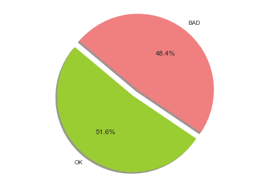
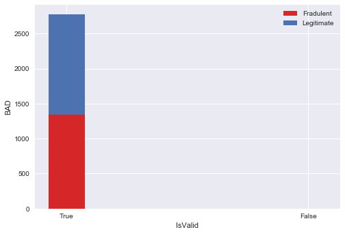
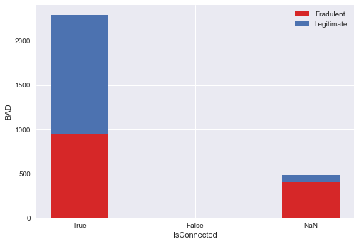
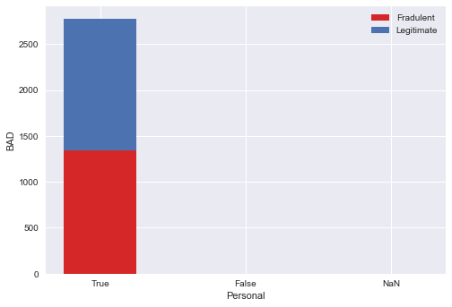
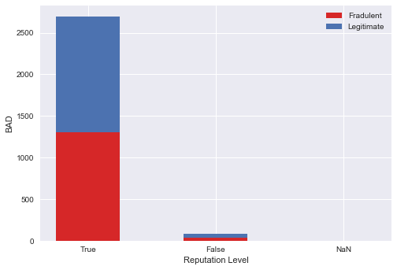
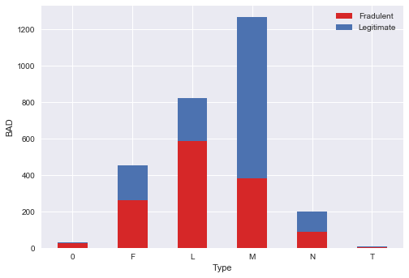
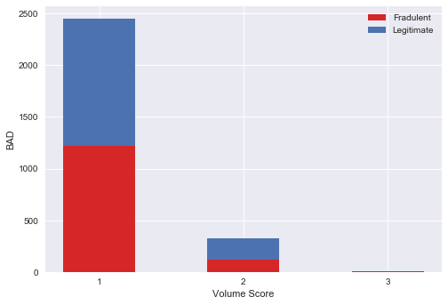
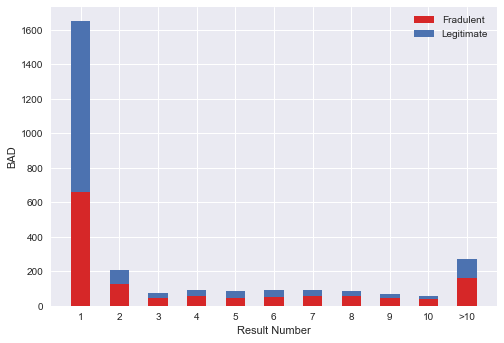

```python
#Dependencies
import csv
import numpy as np
import pandas as pd
import matplotlib.pyplot as plt
import seaborn as sns
import pandas as pd
import string
import scipy.stats as stats
import seaborn as sns
```


```python
file_one = "SFA Craft Demo and Case Study - Huffman.csv"
SFA_df = pd.read_csv(file_one)
SFA_df.head()
```


<div>
<style>
    .dataframe thead tr:only-child th {
        text-align: right;
    }

    .dataframe thead th {
        text-align: left;
    }

    .dataframe tbody tr th {
        vertical-align: top;
    }
</style>
<table border="1" class="dataframe">
  <thead>
    <tr style="text-align: right;">
      <th></th>
      <th>ID</th>
      <th>BAD</th>
      <th>opendate</th>
      <th>AreaCode</th>
      <th>EAScore</th>
      <th>IdentityRank</th>
      <th>DeviceBrowserType</th>
      <th>IpAddressLocCity</th>
      <th>IpAddressLocCountry</th>
      <th>IsValid</th>
      <th>IsConnected</th>
      <th>Personal</th>
      <th>Reputation Level</th>
      <th>ReceivingMail</th>
      <th>Type</th>
      <th>Volume Score</th>
      <th>Result Number</th>
      <th>EmailDays</th>
    </tr>
  </thead>
  <tbody>
    <tr>
      <th>0</th>
      <td>134457</td>
      <td>1</td>
      <td>9/3/15</td>
      <td>973</td>
      <td>NaN</td>
      <td>425.0</td>
      <td>TRIDENT</td>
      <td>NaN</td>
      <td>UNITED STATES</td>
      <td>True</td>
      <td>True</td>
      <td>True</td>
      <td>1</td>
      <td>True</td>
      <td>L</td>
      <td>1</td>
      <td>2</td>
      <td>95</td>
    </tr>
    <tr>
      <th>1</th>
      <td>6360592</td>
      <td>0</td>
      <td>9/28/15</td>
      <td>310</td>
      <td>930.0</td>
      <td>652.0</td>
      <td>TRIDENT</td>
      <td>AUSTIN</td>
      <td>UNITED STATES</td>
      <td>True</td>
      <td>True</td>
      <td>True</td>
      <td>1</td>
      <td>True</td>
      <td>F</td>
      <td>1</td>
      <td>1</td>
      <td>116</td>
    </tr>
    <tr>
      <th>2</th>
      <td>462987</td>
      <td>0</td>
      <td>9/2/15</td>
      <td>502</td>
      <td>704.0</td>
      <td>683.0</td>
      <td>CHROME</td>
      <td>LOUISVILLE</td>
      <td>UNITED STATES</td>
      <td>True</td>
      <td>True</td>
      <td>True</td>
      <td>1</td>
      <td>NaN</td>
      <td>M</td>
      <td>1</td>
      <td>1</td>
      <td>116</td>
    </tr>
    <tr>
      <th>3</th>
      <td>309372</td>
      <td>0</td>
      <td>10/1/15</td>
      <td>518</td>
      <td>113.0</td>
      <td>477.0</td>
      <td>FIREFOX</td>
      <td>SCHENECTADY</td>
      <td>UNITED STATES</td>
      <td>True</td>
      <td>True</td>
      <td>True</td>
      <td>1</td>
      <td>NaN</td>
      <td>L</td>
      <td>1</td>
      <td>1</td>
      <td>1513</td>
    </tr>
    <tr>
      <th>4</th>
      <td>397009</td>
      <td>1</td>
      <td>7/12/15</td>
      <td>713</td>
      <td>NaN</td>
      <td>587.0</td>
      <td>FIREFOX</td>
      <td>LOS ANGELES</td>
      <td>UNITED STATES</td>
      <td>True</td>
      <td>NaN</td>
      <td>True</td>
      <td>1</td>
      <td>NaN</td>
      <td>N</td>
      <td>1</td>
      <td>1</td>
      <td>0</td>
    </tr>
  </tbody>
</table>
</div>


```python
total_records = SFA_df['BAD'].count()
bad = SFA_df[SFA_df['BAD']==1].count()
bad = bad['BAD']
OK = SFA_df[SFA_df['BAD']==0].count()
OK = OK['BAD']
percents = ((OK/total_records)*100, (bad/total_records)*100)
labels = ['OK', 'BAD']
colors = ['lightgreen', 'red']
OK
```


    1433


```python
labels = 'OK', 'BAD'
colors = ['yellowgreen', 'lightcoral']
explode = (0.1, 0)  # explode 1st slice
 
# Plot
plt.pie(percents, explode=explode, labels=labels, colors=colors,
        autopct='%1.1f%%', shadow=True, startangle=140)
 
plt.axis('equal')
plt.show()
```





```python
SFA_df.head()
```


<div>
<style>
    .dataframe thead tr:only-child th {
        text-align: right;
    }

    .dataframe thead th {
        text-align: left;
    }

    .dataframe tbody tr th {
        vertical-align: top;
    }
</style>
<table border="1" class="dataframe">
  <thead>
    <tr style="text-align: right;">
      <th></th>
      <th>ID</th>
      <th>BAD</th>
      <th>opendate</th>
      <th>AreaCode</th>
      <th>EAScore</th>
      <th>IdentityRank</th>
      <th>DeviceBrowserType</th>
      <th>IpAddressLocCity</th>
      <th>IpAddressLocCountry</th>
      <th>IsValid</th>
      <th>IsConnected</th>
      <th>Personal</th>
      <th>Reputation Level</th>
      <th>ReceivingMail</th>
      <th>Type</th>
      <th>Volume Score</th>
      <th>Result Number</th>
      <th>EmailDays</th>
    </tr>
  </thead>
  <tbody>
    <tr>
      <th>0</th>
      <td>134457</td>
      <td>1</td>
      <td>9/3/15</td>
      <td>973</td>
      <td>NaN</td>
      <td>425.0</td>
      <td>TRIDENT</td>
      <td>NaN</td>
      <td>UNITED STATES</td>
      <td>True</td>
      <td>True</td>
      <td>True</td>
      <td>1</td>
      <td>True</td>
      <td>L</td>
      <td>1</td>
      <td>2</td>
      <td>95</td>
    </tr>
    <tr>
      <th>1</th>
      <td>6360592</td>
      <td>0</td>
      <td>9/28/15</td>
      <td>310</td>
      <td>930.0</td>
      <td>652.0</td>
      <td>TRIDENT</td>
      <td>AUSTIN</td>
      <td>UNITED STATES</td>
      <td>True</td>
      <td>True</td>
      <td>True</td>
      <td>1</td>
      <td>True</td>
      <td>F</td>
      <td>1</td>
      <td>1</td>
      <td>116</td>
    </tr>
    <tr>
      <th>2</th>
      <td>462987</td>
      <td>0</td>
      <td>9/2/15</td>
      <td>502</td>
      <td>704.0</td>
      <td>683.0</td>
      <td>CHROME</td>
      <td>LOUISVILLE</td>
      <td>UNITED STATES</td>
      <td>True</td>
      <td>True</td>
      <td>True</td>
      <td>1</td>
      <td>NaN</td>
      <td>M</td>
      <td>1</td>
      <td>1</td>
      <td>116</td>
    </tr>
    <tr>
      <th>3</th>
      <td>309372</td>
      <td>0</td>
      <td>10/1/15</td>
      <td>518</td>
      <td>113.0</td>
      <td>477.0</td>
      <td>FIREFOX</td>
      <td>SCHENECTADY</td>
      <td>UNITED STATES</td>
      <td>True</td>
      <td>True</td>
      <td>True</td>
      <td>1</td>
      <td>NaN</td>
      <td>L</td>
      <td>1</td>
      <td>1</td>
      <td>1513</td>
    </tr>
    <tr>
      <th>4</th>
      <td>397009</td>
      <td>1</td>
      <td>7/12/15</td>
      <td>713</td>
      <td>NaN</td>
      <td>587.0</td>
      <td>FIREFOX</td>
      <td>LOS ANGELES</td>
      <td>UNITED STATES</td>
      <td>True</td>
      <td>NaN</td>
      <td>True</td>
      <td>1</td>
      <td>NaN</td>
      <td>N</td>
      <td>1</td>
      <td>1</td>
      <td>0</td>
    </tr>
  </tbody>
</table>
</div>


```python
IsValid_True = SFA_df[SFA_df['IsValid']==True]
Is_Valid_False = SFA_df[SFA_df['IsValid']==False]
```


```python
IV = SFA_df[['BAD','IsValid']]
#IV = IV.groupby('BAD', as_index = False).count()

IVT = IV[IV['IsValid'] == True]
IVT = IVT.groupby('BAD', as_index = False)['IsValid'].count()

IVF = IV[IV['IsValid'] == False]
IVF = IVF.groupby('BAD', as_index = False)['IsValid'].count()
  
```


```python
IVT_BAD = (IVT.loc[IVT['BAD'] == 1, 'IsValid']).sum()
IVF_BAD = (IVF.loc[IVF['BAD'] == 1, 'IsValid']).sum()

IVT_OK = (IVT.loc[IVT['BAD'] == 0, 'IsValid']).sum()
IVF_OK = (IVF.loc[IVF['BAD'] == 0, 'IsValid']).sum()

# IVT = IVT_BAD[0] + IVT_OK[0]
# IVT_BAD = IVT_BAD[0]/IVT
# IVT_OK = IVT_OK[0]/IVT

# IVF = IVF_BAD[0]
# IVF_BAD = IVF_BAD[0]/IVF
# IVF_OK = 0

BAD = (IVT_BAD, IVF_BAD)
OK = (IVT_OK, 0)
BAD


```


    (1341, 1)


```python
N = 2
ind = np.arange(N)
width = 0.15

# IV_BAD = (1341, 1)
# IV_OK = (1433, 0)

p1 = plt.bar(ind, BAD, width, color='#d62728', label = 'Fradulent')
p2 = plt.bar(ind, OK, width, label = 'Legitimate', bottom = BAD)

plt.ylabel('BAD')
plt.xlabel('IsValid')
plt.xticks(ind, ('True', 'False'))
plt.legend(loc="upper right")
plt.show()


```





```python
IC = SFA_df[['BAD','IsConnected']]
#IV = IV.groupby('BAD', as_index = False).count()

ICT = IC[IC['IsConnected']==True]
ICF = IC[IC['IsConnected']==False]
IC['IsConnected'].fillna(0, inplace = True)
ICNaN = IC[IC['IsConnected']==0]


#IsConnected_True
```

    /anaconda/lib/python3.6/site-packages/pandas/core/generic.py:3549: SettingWithCopyWarning: 
    A value is trying to be set on a copy of a slice from a DataFrame
    
    See the caveats in the documentation: http://pandas.pydata.org/pandas-docs/stable/indexing.html#indexing-view-versus-copy
      self._update_inplace(new_data)


```python

```


```python
ICT_BAD = (ICT.loc[ICT['BAD'] == 1, 'IsConnected']).count()
ICF_BAD = (ICF.loc[ICF['BAD'] == 1, 'IsConnected']).count()
ICNaN_BAD = (ICNaN.loc[ICNaN['BAD'] == 1, 'IsConnected']).count()

ICT_OK = (ICT.loc[ICT['BAD'] == 0, 'IsConnected']).count()
ICF_OK = (ICF.loc[ICF['BAD'] == 0, 'IsConnected']).count()
ICNaN_OK = (ICNaN.loc[ICNaN['BAD'] == 0, 'IsConnected']).count()

BAD = (ICT_BAD, ICF_BAD, ICNaN_BAD)
OK = (ICT_OK, ICF_OK, ICNaN_OK)
BAD
```


    (941, 1, 401)


```python
N = 3
ind = np.arange(N)
width = 0.5

# IV_BAD = (1341, 1)
# IV_OK = (1433, 0)

p1 = plt.bar(ind, BAD, width, color='#d62728', label = 'Fradulent')
p2 = plt.bar(ind, OK, width, label = 'Legitimate', bottom = BAD)

plt.ylabel('BAD')
plt.xlabel('IsConnected')
plt.xticks(ind, ('True', 'False', 'NaN'))
plt.legend(loc="upper right")
plt.show()
```





```python
IP = SFA_df[['BAD','Personal']]
#IV = IV.groupby('BAD', as_index = False).count()

IPT = IP[IP['Personal']==True]
IPF = IP[IP['Personal']==False]
IP['Personal'].fillna(0, inplace = True)
IPNaN = IP[IP['Personal']==0]
```

    /anaconda/lib/python3.6/site-packages/pandas/core/generic.py:3549: SettingWithCopyWarning: 
    A value is trying to be set on a copy of a slice from a DataFrame
    
    See the caveats in the documentation: http://pandas.pydata.org/pandas-docs/stable/indexing.html#indexing-view-versus-copy
      self._update_inplace(new_data)


```python
IPT_BAD = (IPT.loc[IPT['BAD'] == 1, 'Personal']).count()
IPF_BAD = (IPF.loc[IPF['BAD'] == 1, 'Personal']).count()
IPNaN_BAD = (IPNaN.loc[IPNaN['BAD'] == 1, 'Personal']).count()

IPT_OK = (IPT.loc[IPT['BAD'] == 0, 'Personal']).count()
IPF_OK = (IPF.loc[IPF['BAD'] == 0, 'Personal']).count()
IPNaN_OK = (IPNaN.loc[IPNaN['BAD'] == 0, 'Personal']).count()

# IPT_Total = ICT_BAD + ICT_OK
# IPF_Total = ICF_BAD + ICF_OK
# IPN_Total = ICNaN_BAD + ICNaN_OK

IPT_BAD = IPT_BAD
IPF_BAD = IPF_BAD
IPNaN_BAD = IPNaN_BAD

IPT_OK = IPT_OK
IPF_OK = IPF_OK
IPNaN_OK = IPNaN_OK

BAD = (IPT_BAD, IPF_BAD, IPNaN_BAD)
OK = (IPT_OK, IPF_OK, IPNaN_OK)
```


```python
N = 3
ind = np.arange(N)
width = 0.5

# IV_BAD = (1341, 1)
# IV_OK = (1433, 0)

p1 = plt.bar(ind, BAD, width, color='#d62728', label = 'Fradulent')
p2 = plt.bar(ind, OK, width, label = 'Legitimate', bottom = BAD)

plt.ylabel('BAD')
plt.xlabel('Personal')
plt.xticks(ind, ('True', 'False', 'NaN'))
plt.legend(loc="upper right")
plt.show()
```





```python
IR = SFA_df[['BAD','Reputation Level']]
#IV = IV.groupby('BAD', as_index = False).count()

IR1 = IR[IR['Reputation Level']==1]
IR2 = IR[IR['Reputation Level']==2]
IR3 = IR[IR['Reputation Level']==3]
```


```python
IR1_BAD = (IR1.loc[IR1['BAD'] == 1, 'Reputation Level']).count()
IR2_BAD = (IR2.loc[IR2['BAD'] == 1, 'Reputation Level']).count()
IR3_BAD = (IR3.loc[IR3['BAD'] == 1, 'Reputation Level']).count()

IR1_OK = (IR1.loc[IR1['BAD'] == 0, 'Reputation Level']).count()
IR2_OK = (IR2.loc[IR2['BAD'] == 0, 'Reputation Level']).count()
IR3_OK = (IR3.loc[IR3['BAD'] == 0, 'Reputation Level']).count()

# IPT_Total = ICT_BAD + ICT_OK
# IPF_Total = ICF_BAD + ICF_OK
# IPN_Total = ICNaN_BAD + ICNaN_OK

# IPT_BAD = IPT_BAD
# IPF_BAD = IPF_BAD
# IPNaN_BAD = IPNaN_BAD

# IPT_OK = IPT_OK
# IPF_OK = IPF_OK
# IPNaN_OK = IPNaN_OK

BAD = (IR1_BAD, IR2_BAD, IR3_BAD)
OK = (IR1_OK, IR2_OK, IR3_OK)
```


```python
N = 3
ind = np.arange(N)
width = 0.5

# IV_BAD = (1341, 1)
# IV_OK = (1433, 0)

p1 = plt.bar(ind, BAD, width, color='#d62728', label = 'Fradulent')
p2 = plt.bar(ind, OK, width, label = 'Legitimate', bottom = BAD)

plt.ylabel('BAD')
plt.xlabel('Reputation Level')
plt.xticks(ind, ('True', 'False', 'NaN'))
plt.legend(loc="upper right")
plt.show()
```





```python
IT = SFA_df[['BAD','Type']]
#IV = IV.groupby('BAD', as_index = False).count()

IT0 = IT[IT['Type']=='0']
ITF = IT[IT['Type']=='F']
ITL = IT[IT['Type']=='L']
ITM = IT[IT['Type']=='M']
ITN = IT[IT['Type']=='N']
ITT = IT[IT['Type']=='T']
```


```python
IT0_BAD = (IT0.loc[IT0['BAD'] == 1, 'Type']).count()
ITF_BAD = (ITF.loc[ITF['BAD'] == 1, 'Type']).count()
ITL_BAD = (ITL.loc[ITL['BAD'] == 1, 'Type']).count()
ITM_BAD = (ITM.loc[ITM['BAD'] == 1, 'Type']).count()
ITN_BAD = (ITN.loc[ITN['BAD'] == 1, 'Type']).count()
ITT_BAD = (ITT.loc[ITT['BAD'] == 1, 'Type']).count()

IT0_OK = (IT0.loc[IT0['BAD'] == 0, 'Type']).count()
ITF_OK = (ITF.loc[ITF['BAD'] == 0, 'Type']).count()
ITL_OK = (ITL.loc[ITL['BAD'] == 0, 'Type']).count()
ITM_OK = (ITM.loc[ITM['BAD'] == 0, 'Type']).count()
ITN_OK = (ITN.loc[ITN['BAD'] == 0, 'Type']).count()
ITT_OK = (ITT.loc[ITT['BAD'] == 0, 'Type']).count()
# IPF_Total = ICF_BAD + ICF_OK
# IPN_Total = ICNaN_BAD + ICNaN_OK

# IPT_BAD = IPT_BAD
# IPF_BAD = IPF_BAD
# IPNaN_BAD = IPNaN_BAD

# IPT_OK = IPT_OK
# IPF_OK = IPF_OK
# IPNaN_OK = IPNaN_OK

BAD = (IT0_BAD, ITF_BAD, ITL_BAD, ITM_BAD, ITN_BAD, ITT_BAD)
OK = (IT0_OK, ITF_OK, ITL_OK, ITM_OK, ITN_OK, ITT_OK)
```


```python
N = 6
ind = np.arange(N)
width = 0.5

# IV_BAD = (1341, 1)
# IV_OK = (1433, 0)

p1 = plt.bar(ind, BAD, width, color='#d62728', label = 'Fradulent')
p2 = plt.bar(ind, OK, width, label = 'Legitimate', bottom = BAD)

plt.ylabel('BAD')
plt.xlabel('Type')
plt.xticks(ind, ('0','F', 'L', 'M', 'N', 'T'))
plt.legend(loc="upper right")
plt.show()
```





```python
IVS = SFA_df[['BAD','Volume Score']]
#IV = IV.groupby('BAD', as_index = False).count()

IVS1 = IVS[IVS['Volume Score']== 1]
IVS2 = IVS[IVS['Volume Score']== 2]
IVS3 = IVS[IVS['Volume Score']== 3]

```


```python
IVS1_BAD = (IVS1.loc[IVS1['BAD'] == 1, 'Volume Score']).count()
IVS2_BAD = (IVS2.loc[IVS2['BAD'] == 1, 'Volume Score']).count()
IVS3_BAD = (IVS3.loc[IVS3['BAD'] == 1, 'Volume Score']).count()

IVS1_OK = (IVS1.loc[IVS1['BAD'] == 0, 'Volume Score']).count()
IVS2_OK = (IVS2.loc[IVS2['BAD'] == 0, 'Volume Score']).count()
IVS3_OK = (IVS3.loc[IVS3['BAD'] == 0, 'Volume Score']).count()

BAD = (IVS1_BAD, IVS2_BAD, IVS3_BAD)
OK = (IVS1_OK, IVS2_OK, IVS3_OK)
OK
```


    (1232, 200, 1)


```python
N = 3
ind = np.arange(N)
width = 0.5

# IV_BAD = (1341, 1)
# IV_OK = (1433, 0)

p1 = plt.bar(ind, BAD, width, color='#d62728', label = 'Fradulent')
p2 = plt.bar(ind, OK, width, label = 'Legitimate', bottom = BAD)

plt.ylabel('BAD')
plt.xlabel('Volume Score')
plt.xticks(ind, ('1', '2', '3'))
plt.legend(loc="upper right")
plt.show()
```





```python

```


```python

```


```python
RN = SFA_df[['BAD','Result Number']]
#IV = IV.groupby('BAD', as_index = False).count()

RN1 = RN[RN['Result Number']== 1]
RN2 = RN[RN['Result Number']== 2]
RN3 = RN[RN['Result Number']== 3]
RN4 = RN[RN['Result Number']== 4]
RN5 = RN[RN['Result Number']== 5]
RN6 = RN[RN['Result Number']== 6]
RN7 = RN[RN['Result Number']== 7]
RN8 = RN[RN['Result Number']== 8]
RN9 = RN[RN['Result Number']== 9]
RN10 = RN[RN['Result Number']== 10]
RN_10 = RN[RN['Result Number'] > 10]
RN1.head()


```


<div>
<style>
    .dataframe thead tr:only-child th {
        text-align: right;
    }

    .dataframe thead th {
        text-align: left;
    }

    .dataframe tbody tr th {
        vertical-align: top;
    }
</style>
<table border="1" class="dataframe">
  <thead>
    <tr style="text-align: right;">
      <th></th>
      <th>BAD</th>
      <th>Result Number</th>
    </tr>
  </thead>
  <tbody>
    <tr>
      <th>1</th>
      <td>0</td>
      <td>1</td>
    </tr>
    <tr>
      <th>2</th>
      <td>0</td>
      <td>1</td>
    </tr>
    <tr>
      <th>3</th>
      <td>0</td>
      <td>1</td>
    </tr>
    <tr>
      <th>4</th>
      <td>1</td>
      <td>1</td>
    </tr>
    <tr>
      <th>5</th>
      <td>1</td>
      <td>1</td>
    </tr>
  </tbody>
</table>
</div>


```python
RN1_BAD = (RN1.loc[RN1['BAD'] == 1, 'Result Number']).count()
RN2_BAD = (RN2.loc[RN2['BAD'] == 1, 'Result Number']).count()
RN3_BAD = (RN3.loc[RN3['BAD'] == 1, 'Result Number']).count()
RN4_BAD = (RN4.loc[RN4['BAD'] == 1, 'Result Number']).count()
RN5_BAD = (RN5.loc[RN5['BAD'] == 1, 'Result Number']).count()
RN6_BAD = (RN6.loc[RN6['BAD'] == 1, 'Result Number']).count()
RN7_BAD = (RN7.loc[RN7['BAD'] == 1, 'Result Number']).count()
RN8_BAD = (RN8.loc[RN8['BAD'] == 1, 'Result Number']).count()
RN9_BAD = (RN9.loc[RN9['BAD'] == 1, 'Result Number']).count()
RN10_BAD = (RN10.loc[RN10['BAD'] == 1, 'Result Number']).count()
RN_10_BAD = (RN_10.loc[RN_10['BAD'] == 1, 'Result Number']).count()

RN1_OK = (RN1.loc[RN1['BAD'] == 0, 'Result Number']).count()
RN2_OK = (RN2.loc[RN2['BAD'] == 0, 'Result Number']).count()
RN3_OK = (RN3.loc[RN3['BAD'] == 0, 'Result Number']).count()
RN4_OK = (RN4.loc[RN4['BAD'] == 0, 'Result Number']).count()
RN5_OK = (RN5.loc[RN5['BAD'] == 0, 'Result Number']).count()
RN6_OK = (RN6.loc[RN6['BAD'] == 0, 'Result Number']).count()
RN7_OK = (RN7.loc[RN7['BAD'] == 0, 'Result Number']).count()
RN8_OK = (RN8.loc[RN8['BAD'] == 0, 'Result Number']).count()
RN9_OK = (RN9.loc[RN9['BAD'] == 0, 'Result Number']).count()
RN10_OK = (RN10.loc[RN10['BAD'] == 0, 'Result Number']).count()
RN_10_OK = (RN_10.loc[RN_10['BAD'] == 0, 'Result Number']).count()

BAD = (RN1_BAD, RN2_BAD, RN3_BAD, RN4_BAD, RN5_BAD, RN6_BAD, RN7_BAD, RN8_BAD, RN9_BAD, RN10_BAD, RN_10_BAD)
OK = (RN1_OK, RN2_OK, RN3_OK, RN4_OK, RN5_OK, RN6_OK, RN7_OK, RN8_OK, RN9_OK, RN10_OK, RN_10_OK)

```


```python
N = 11
ind = np.arange(N)
width = 0.5

# IV_BAD = (1341, 1)
# IV_OK = (1433, 0)

p1 = plt.bar(ind, BAD, width, color='#d62728', label = 'Fradulent')
p2 = plt.bar(ind, OK, width, label = 'Legitimate', bottom = BAD)

plt.ylabel('BAD')
plt.xlabel('Result Number')
plt.xticks(ind, ('1', '2', '3', '4', '5', '6', '7', '8', '9', '10', '>10'))
plt.legend(loc="upper right")
plt.show()
```





```python

```
